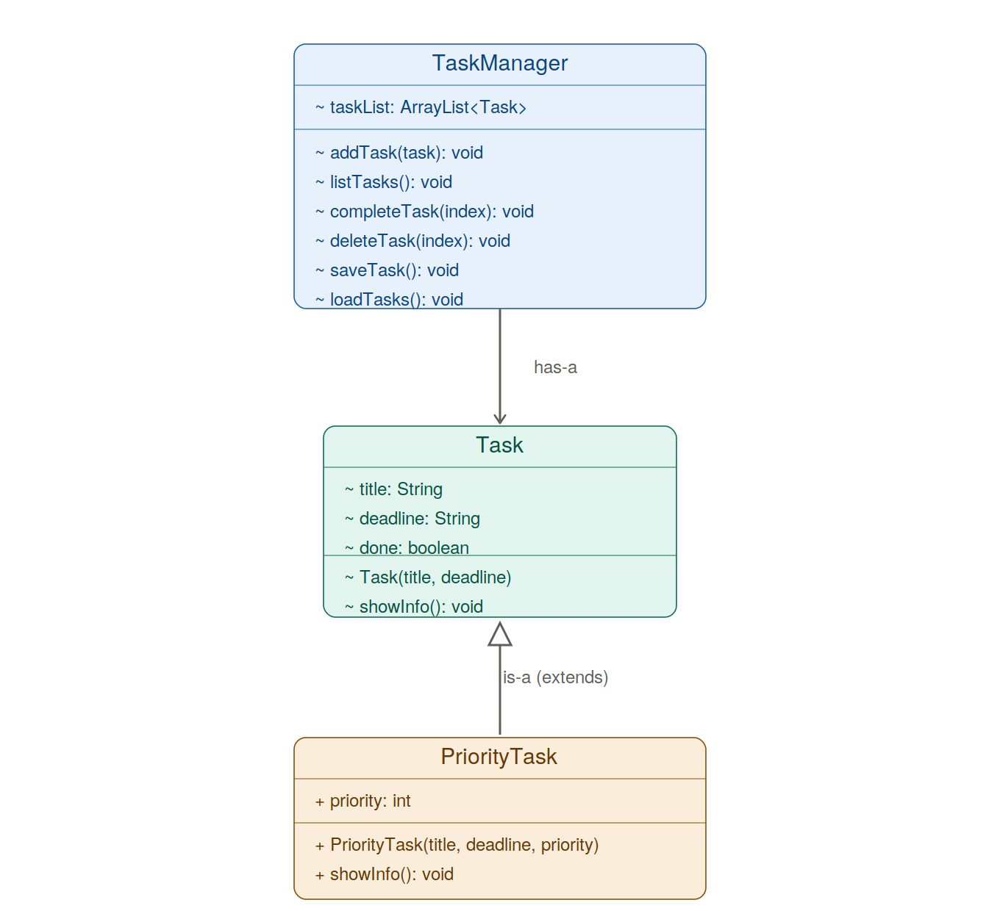

# task-cli 📝

A simple command line task manager written in Java. You can add tasks, list them, mark them as complete, and delete them. Tasks are saved to a file, so your data stays even after you close the program.

I built this project to practice object-oriented programming (OOP) in Java from scratch — designing classes myself, using inheritance, and handling file persistence.

## Features

- **Add tasks** with a title and deadline
- **List all tasks** with their status (complete / incomplete)
- **Complete a task** by its index
- **Delete a task** by its index
- **File persistence** — tasks are saved to `tasks.txt` and loaded back on startup
- **Priority tasks** — a `PriorityTask` type that extends `Task` and adds a priority level (demonstrates inheritance and polymorphism)

## OOP Concepts Practiced

- **Encapsulation** — each class manages its own data
- **Inheritance** — `PriorityTask` extends `Task`, reusing its fields and constructor via `super`
- **Polymorphism** — `showInfo()` is overridden in `PriorityTask`, so the same method call produces different output depending on the object type
- **File I/O & exception handling** — reading and writing files with `FileWriter` and `Scanner`, with `try / catch / finally`

## Class Design (UML)



- `TaskManager` **has-a** list of `Task` objects (it holds and manages them).
- `PriorityTask` **is-a** `Task` (it inherits from `Task` and adds a priority field).

## Project Structure

## Project Structure

```
task-cli/
├── src/
│   ├── Main.java          # Entry point — runs the program
│   ├── Task.java          # Base task class (title, deadline, done)
│   ├── PriorityTask.java  # Subclass that adds a priority level
│   └── TaskManager.java   # Manages the task list and file saving/loading
├── tasks.txt              # Saved task data
└── uml-class-diagram.png  # Class diagram
```

## How to Run

1. Clone the repository:
   \`\`\`bash
   git clone https://github.com/NaaaaooGit-Hub/task-cli.git
   cd task-cli
   \`\`\`

2. Compile the Java files:
   \`\`\`bash
   javac src/*.java
   \`\`\`

3. Run the program:
   \`\`\`bash
   java -cp src Main
   \`\`\`

## What I Learned

This was my hands on practice for Java OOP. I designed the `Task` and `TaskManager` classes myself, then added a `PriorityTask` subclass to understand how inheritance and method overriding work. The most interesting part was seeing polymorphism in action: calling the same `showInfo()` method on different object types produces different output without changing the calling code.

---

*Built by [NaaaaooGit-Hub](https://github.com/NaaaaooGit-Hub)*
